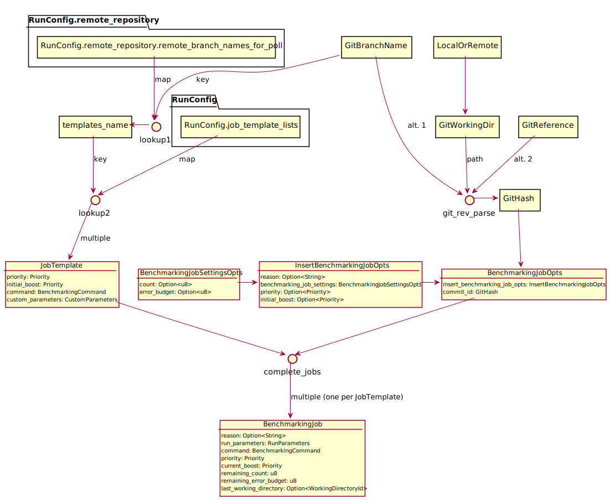

# Job insertion

A `BenchmarkingJob` is the full data structure that contains all the
information for running a job, including state that changes during its
execution (which is multiple benchmarking runs).

Its parts are:

- a `reason` string
- `RunParameters`: commit id and custom parameters.
- `BenchmarkingCommand`: what command to run where (target), and
  optionally Bash code to run before doing so.
- two `Priority` values: `priority` and `current_boost`
- `BenchmarkingJobState`: remaining run count, remaining error budget, and
  the last-used working directory.

Since there are many parameters, these must be configured in the
configuration file, or specified via an existing job file
(serialisation of `BenchmarkingJob`)--those can be found in the queues
directories.

Here are the possible data flows for creating a benchmarking job:

<small>*Note: for technical reasons (access protection (and
borrowing?)), the actual BenchmarkingJob struct does not directly
contain the fields as shown, but instead groups them via structs that
are not shown here. But it flattens those sub-structs for
serialization (via `#[serde(flatten)]` attributes); the view here
corresponds to the nesting as shown in the benchmarking job
files. `Arc` wrappers have been left out.*</small>

If an existing job file is given, then of course it could be inserted
directly.

Some parameters can be overridden via command line options, via the
`InsertBenchmarkingJobOpts` struct (as part of struct `InsertOpts`).

If a `BenchmarkingJob` is to be created from a new commit, then the
remaining information must be collected from configuration (and also
optionally tweaked via command line overrides).

Configuration happens in multiple levels:

1. The `targets` configuration field contains a list of
   `BenchmarkingTarget`s, which define the `BenchmarkingCommand` that
   ends up in a job, which also specifies a `target_name` which works
   as a key, and a map of allowed custom parameters and their value
   types for that target.

1. The `job_template_lists` configuration field contains a map of
   named lists of `JobTemplate`s. Each `JobTemplate` declares
   priorities, `target_name` and the custom parameters to use. 
   
1. The `benchmarking_job_settings` configuration field specifies a
   `BenchmarkingJobSettings` value, which specifies the initial run
   count and error budget. These values are used for all jobs.

1. The `remote_repository.remote_branch_names_for_poll` configuration
   field specifies a map from branch name to a list of `JobTemplate`s,
   either inline via `Val`, or by referencing an entry from
   `job_template_lists` by name via `Ref`. Inserting a commit from a
   branch normally takes the configuration specified here.

So, building a `BenchmarkingJob` via configuration requires a commit
id (specified directly, or via a branch name or other Git reference),
and then either a job template list name directly (via
`job_template_lists`), or a branch name that specifies templates in
`remote_repository.remote_branch_names_for_poll`.

Resolving branch names or other Git references to commit ids (and also
finding default branch names) can happen on the upstream repository or
a local clone, thus "local" or "remote" must be specified in the cases
where this choice appears.

Configuration that can be optionally completed from the command line
is taken via `BenchmarkingJobOpts`, which contains all values as
`Option`s (including an instance of `BenchmarkingJobSettingsOpts`,
which itself contains `Option`s and can be converted to
`BenchmarkingJobSettings` which has the same values but as
non-`Option`s). `BenchmarkingJobOpts` has a `complete_jobs` method,
that takes an optional `BenchmarkingJobSettingsOpts` and a list of
`JobTemplate`s creates a `Vec<BenchmarkingJob>`. The `JobTemplate`s
are first obtained via templates name or branch name.
